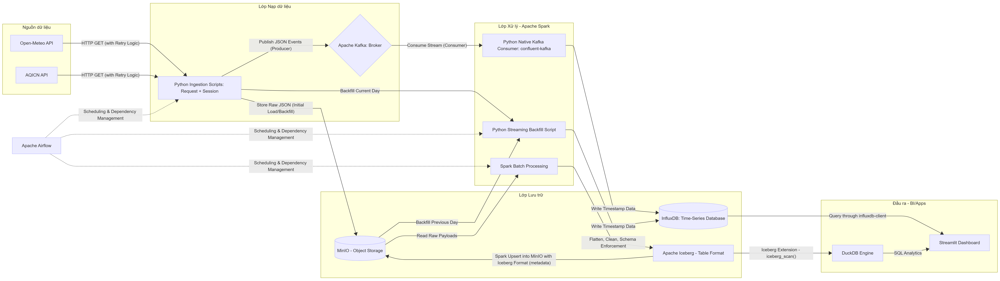

  

## 1. Project Overview
- **Mục tiêu:** Xây dựng Data Pipeline End-to-End theo kiến trúc Lambda để thu thập, xử lý và lưu trữ dữ liệu thời tiết (Open-Meteo API) và chất lượng không khí (AQICN API) tại Hà Nội.
- **Môi trường triển khai:** Windows 11 + WSL2 Ubuntu, 100% Containerized.
- **Tài nguyên phần cứng:** 8 Cores CPU, 16GB RAM. 

## 2. Technology Stack
- **Ngôn ngữ:** Python 3.10+
- **Infrastructure:** Docker & Docker Compose
- **Orchestration:** Apache Airflow v2.8.1 (LocalExecutor)
- **Message Broker:** Apache Kafka v3.7.0 (Chạy ở chế độ KRaft)
- **Data Lake/Object Storage:** MinIO (S3-compatible)
- **Time-Series DB (Streaming):** InfluxDB v2.7
- **Data Processing (Batch):** PySpark v3.5.0
- **Table Format:** Apache Iceberg
- **Serving/OLAP:** DuckDB v1.1.3
- **Dashboard:** Streamlit v1.31.1

## 3. Architecture Design
- **Streaming Path:** 
    - Sử dụng Python Native Consumer để xử lý dữ liệu.
    - Trong Consumer thiết lập `enable.auto.commit=False` và chỉ commit offset sau khi ghi thành công vào InfluxDB (At-least-once delivery).
    - triển khai cơ chế "Stateful Check": Lưu lại mốc thời gian (timestamp) của lần trích xuất thành công gần nhất. Nếu dữ liệu mới lấy về có cùng timestamp với dữ liệu cũ, bỏ qua không đẩy vào Kafka.
- **Batch Path:** 
    - Kéo dữ liệu raw vào MinIO (Bronze layer), sau đó dùng PySpark + Iceberg làm sạch, schema enforcement và lưu trữ thành định dạng Parquet (Silver layer) và thực hiện Pre-aggregation/Pre-computation (Gold layer). 
    - Thực hiện Phân vùng (Partitioning) theo thời gian.
- **Idempotency (Tính Lũy Đẳng):** 
    - Mọi tác vụ Airflow và PySpark được thiết kế để đảm bảo tính nhất quán và chuẩn xác của dữ liệu khi chạy lại. 
    - Thực hiện qua sử dụng lệnh `MERGE INTO` (Upsert) của Iceberg dựa trên khóa chính (`Station_ID` + `Timestamp`) để tránh trùng lặp dữ liệu.
- **Error Handling & Rate Limits:** 
    - Cấu hình trong các script gọi API (Producer/Extractor) các cơ chế Retry với Exponential Backoff (dùng thư viện `tenacity`).
- **Bảo mật:**
    - Thực hiện đọc mọi thông tin nhạy cảm từ biến môi trường (Environment Variables) qua thư viện `python-dotenv`. 

## 5. Optimization Strategy
- **Tối ưu hóa Mạng (Network I/O):** 
    - Connection Pooling: Sử dụng `requests.Session()`, HTTPAdapter và các cơ chế pool kết nối để tái sử dụng socket TCP, giảm độ trễ handshake SSL. 
- **RAM Optimization (Streaming):** 
    - Lựa chọn xử lý streaming bằng Python Native và lưu trữ vào InfluxDB (Disk-based columnar engine) để giải tỏa áp lực bộ nhớ so với các công cụ In-memory.
- **OLAP Optimization (Phân tích):** 
    - Giao diện Dashboard (Streamlit) sử dụng DuckDB làm engine truy vấn dữ liệu lịch sử từ Lakehouse. 
    - Tận dụng cơ chế *vectorized execution* và *spilling to disk* của DuckDB để truy vấn lượng lớn tệp Parquet mà không gây tràn RAM.
    - Pre-aggregation: Batch job tính toán sẵn các chỉ số trung bình (ví dụ: AQI hàng tháng) tại lớp "Gold", chuyển gánh nặng tính toán từ Dashboard sang Spark.
- **Tối ưu hóa Lưu trữ (Storage):** 
    - Columnar Parquet: Sử dụng định dạng cột giúp hỗ trợ predicate pushdown, chỉ đọc các cột cần thiết cho truy vấn. 
    - Partitioning: Phân vùng dữ liệu Iceberg theo năm/tháng để thu hẹp phạm vi tìm kiếm, đồng thời kiểm soát kích thước partition để tránh lỗi "Small File Problems". 
    - Retention & Downsampling: InfluxDB tự động xóa dữ liệu cũ (sau 30 ngày) để duy trì hiệu suất hệ thống.

## 6. Backfill & Recovery Strategy
- **Batch Backfill (Airflow):** Sử dụng tính năng Catch-up của Airflow kết hợp tham số `logical_date` qua Jinja Templates. Cơ chế Upsert của Iceberg (`MERGE INTO`) đảm bảo an toàn tuyệt đối khi chạy lại pipeline.
- **Streaming Backfill (Airflow):** 
    - KHÔNG đẩy dữ liệu quá khứ vào Kafka Consumer đang chạy thời gian thực để tránh "tắc đường" (bottleneck).
    - Viết script Backfill độc lập, sử dụng module biến đổi dữ liệu dùng chung, và ghi đè thẳng vào InfluxDB với mốc Timestamp gốc.
- **Nguồn Dữ liệu Backfill cho Streaming:**
    - *Phục hồi dữ liệu ngày cũ:* Ưu tiên lấy dữ liệu từ SSOT (Single Source of Truth) là các file Parquet trong MinIO (Iceberg).
    - *Phục hồi dữ liệu trong ngày (Intraday gap):* Khi dữ liệu chưa kịp vào MinIO, script tự động dự phòng bằng cách gọi tính năng "Past Hours" của API (i.e. trong Open-Meteo Weather, và Open-Meteo Air Quality).
